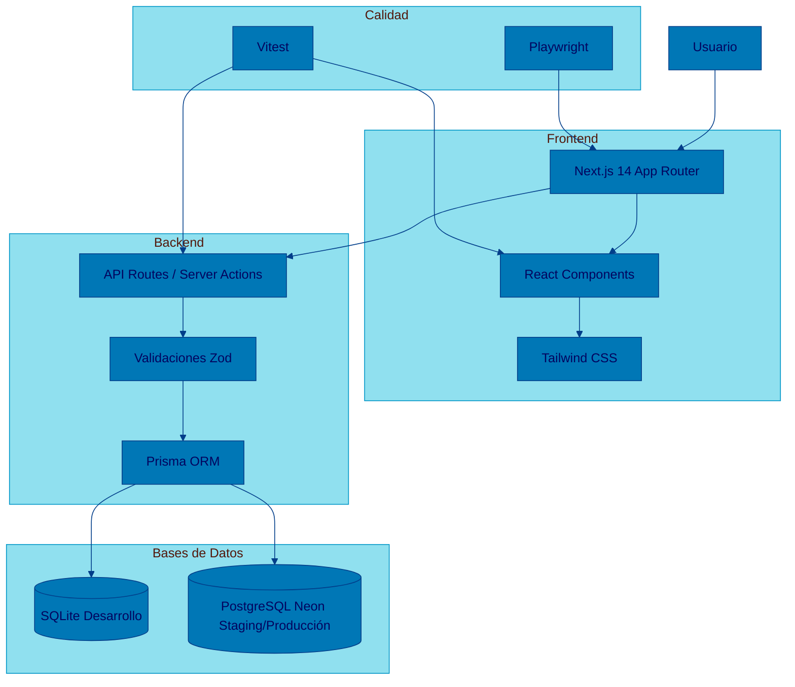

# lag-gobierno-ai

App de Gobierno de AI para Logiztik Alliance Group (LAG). Módulo de Catálogo de Herramientas Aprobadas.

---

## Qué es

Aplicación web donde los empleados de LAG consultan qué herramientas de AI están aprobadas según el nivel de clasificación de los datos que necesitan procesar.

- 27 herramientas autorizadas + 4 retiradas
- 4 niveles de clasificación: Pública, Interna, Confidencial, Restringida
- Indicador semáforo visual (verde/amarillo/rojo)
- ~200 usuarios, ~30 concurrentes

---

## Stack

| Capa         | Tecnología              |
| ------------ | ----------------------- |
| Framework    | Next.js 14 (App Router) |
| Lenguaje     | TypeScript (strict)     |
| Styling      | Tailwind CSS            |
| ORM          | Prisma                  |
| BD Dev       | SQLite                  |
| BD Staging   | PostgreSQL (Neon)       |
| Validaciones | Zod                     |
| Tests Unit   | Vitest                  |
| Tests E2E    | Playwright              |
| CI/CD        | GitHub Actions          |




---

## Metodología

Este proyecto se construye con:

- **BMAD** (Business Methodology for AI Development) — agentes especializados por rol
- **SDD** (Specification Driven Development) — las specs gobiernan el código
- **Context Engineering** — conocimiento estructurado en `docs/` para que agentes y personas lean lo mismo

---

## IDE soportados

| IDE                      |        Contexto se carga via        |                   Agentes se invocan via                    |
| ------------------------ | :---------------------------------: | :---------------------------------------------------------: |
| Kiro                     | `.kiro/steering/project-context.md` |             `.kiro/skills/` (skills activables)             |
| VS Code + GitHub Copilot |  `.github/copilot-instructions.md`  | `.github/agents/` (escribir `@analyst`, `@architect`, etc.) |

Ambos leen la misma fuente de verdad (`docs/`). Sin duplicidad.

---

## Setup rápido

```bash
git clone https://github.com/[org]/lag-gobierno-ai.git
cd lag-gobierno-ai
npm install
cp .env.example .env
npx prisma generate
npm run dev
```
---
Abrir http://localhost:3000

---

## Flujo de desarrollo (SDD)

1. BA genera → spec/[feature]/requirements.md (con agente Analyst)
2. Arquitecto genera → spec/[feature]/design.md + tasks.md (con agente Architect)
3. Developer implementa → src/ (con agente Dev, leyendo tasks.md)
4. QA genera tests → tests/ (con agente QA, leyendo requirements.md)
5. DevOps genera pipeline → .github/workflows/ (con agente DevOps)
6. Push → CI/CD → tests → deploy a staging
---

## Licencia
Uso interno — Logiztik Alliance Group.