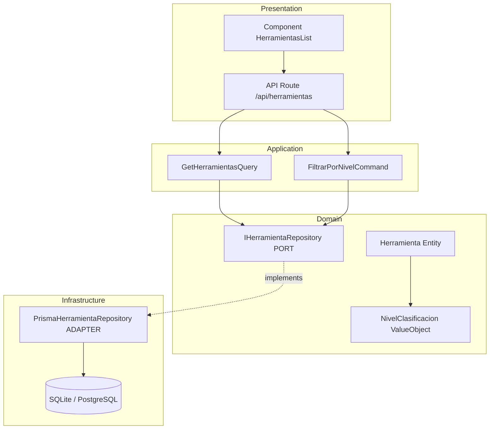

# Clean Architecture — Guía Unificada para Agentes BMAD

> **Fuente:** Consolidación de 28+ skills de Clean Architecture (domain entities, CQRS, repository pattern, result pattern, domain events, orchestrator)
> **Adaptación:** Principios agnósticos del lenguaje. Los ejemplos de código se adaptan al stack del proyecto (Next.js + TypeScript + Prisma para LAG, .NET para otros proyectos).
> **Uso:** Referenciar desde `_bmad/custom/bmad-agent-architect.toml` como persistent_fact via `file:`

---

## Arquitectura de Capas

```
┌─────────────────────────────────────────────────────────────┐
│                    Presentation Layer                        │
│  API Routes, UI Components, Request/Response DTOs           │
├─────────────────────────────────────────────────────────────┤
│                   Infrastructure Layer                       │
│  ORM, Repositories impl, External Services, Auth            │
├─────────────────────────────────────────────────────────────┤
│                    Application Layer                         │
│  Use Cases, Commands, Queries, Validators, DTOs             │
├─────────────────────────────────────────────────────────────┤
│                      Domain Layer                            │
│  Entities, Value Objects, Domain Events, Interfaces (Ports) │
└─────────────────────────────────────────────────────────────┘
```

**Dependency Rule:** Las dependencias SIEMPRE apuntan hacia adentro. Domain no tiene dependencias externas. Application depende solo de Domain. Infrastructure implementa interfaces definidas en Domain/Application.

---

## Principios Fundamentales

### 1. Separación en Capas (Dependency Rule)

| Capa | Responsabilidad | Depende de | NO depende de |
|:----:|:---------------:|:----------:|:-------------:|
| Domain | Lógica de negocio pura, entidades, value objects, interfaces | Nada | Framework, BD, UI |
| Application | Orquestación de use cases, validación | Domain | Infrastructure, UI |
| Infrastructure | Implementaciones técnicas (BD, APIs externas) | Domain, Application | UI |
| Presentation | UI, API endpoints, controllers | Application, Infrastructure | — |

### 2. Inversión de Dependencias (Ports & Adapters)

- **Port:** Interfaz definida en Domain o Application (ej: `IHerramientaRepository`)
- **Adapter:** Implementación en Infrastructure (ej: `PrismaHerramientaRepository`)
- El código de negocio NUNCA conoce la implementación concreta

### 3. Entidades con Comportamiento (Rich Domain Model)

- Las entidades NO son DTOs anémicos con solo getters/setters
- El comportamiento (validación, reglas de negocio) vive DENTRO de la entidad
- Factory methods para creación con validación
- Setters privados — modificación solo via métodos de dominio

### 4. Result Pattern (Sin excepciones para errores de negocio)

- Las operaciones retornan `Result<T>` (éxito o error)
- Las excepciones son para errores INESPERADOS (BD caída, red falla)
- Los errores de negocio (email duplicado, nombre vacío) retornan Result.Failure
- El caller SIEMPRE maneja ambos casos

### 5. CQRS (Command Query Responsibility Segregation)

- **Commands:** Modifican estado, retornan void o ID creado. Un handler por command.
- **Queries:** Solo lectura, retornan datos. Pueden usar acceso directo a BD optimizado.
- Separar lectura de escritura permite optimizar cada lado independientemente.

### 6. Domain Events

- Eventos inmutables en tiempo pasado (ej: `HerramientaRetiradaDomainEvent`)
- Raised por la entidad cuando cambia su estado
- Handlers independientes que reaccionan (enviar email, actualizar cache, etc.)
- No hay retorno — son notificaciones fire-and-forget

---

## Estructura de Carpetas (Adaptada al Stack)

### Para Next.js + TypeScript + Prisma (proyecto LAG):

```
src/
├── domain/                         ← Capa Domain (CERO dependencias de framework)
│   ├── herramienta/
│   │   ├── herramienta.entity.ts   ← Entidad con factory method + validación
│   │   ├── herramienta.errors.ts   ← Errores tipados del dominio
│   │   ├── herramienta.repository.ts ← Interface (PORT)
│   │   ├── herramienta.events.ts   ← Domain events
│   │   └── value-objects/
│   │       ├── nivel-clasificacion.ts
│   │       └── semaforo-uso.ts
│   └── abstractions/
│       ├── entity.base.ts
│       ├── result.ts               ← Result<T> pattern
│       └── domain-event.ts
│
├── application/                    ← Capa Application (orquestación)
│   ├── herramientas/
│   │   ├── queries/
│   │   │   ├── get-herramientas.query.ts
│   │   │   └── get-herramienta-by-id.query.ts
│   │   ├── commands/
│   │   │   └── filtrar-por-nivel.command.ts
│   │   └── dtos/
│   │       └── herramienta.response.ts
│   └── abstractions/
│       ├── use-case.ts
│       └── validator.ts
│
├── infrastructure/                 ← Capa Infrastructure (implementaciones)
│   ├── repositories/
│   │   └── prisma-herramienta.repository.ts  ← ADAPTER (implementa el PORT)
│   ├── database/
│   │   └── prisma.client.ts
│   └── services/
│       └── ...
│
└── presentation/                   ← Capa Presentation (UI + API routes)
    ├── api/
    │   └── herramientas/
    │       └── route.ts            ← Next.js API route (thin, solo orquesta)
    └── components/
        ├── HerramientasList.tsx
        └── HerramientasFilter.tsx
```

### Para .NET (proyectos backend enterprise):

```
src/
├── {name}.domain/
│   ├── Abstractions/ (Entity, Result, IDomainEvent, IUnitOfWork)
│   └── {Aggregate}/ (Entity, Errors, Events, ValueObjects, IRepository)
├── {name}.application/
│   ├── {Feature}/ (Commands, Queries, Handlers, Validators, DTOs)
│   └── Abstractions/ (ICommand, IQuery, Behaviors)
├── {name}.infrastructure/
│   ├── Repositories/ (EF Core implementations)
│   ├── Configurations/ (Entity mapping)
│   └── Services/ (External integrations)
└── {name}.api/
    ├── Endpoints/ (Minimal API)
    └── Middleware/
```

---

## Patrones Clave

### Repository Pattern

- **Interface en Domain** (port): define QUÉ operaciones existen
- **Implementación en Infrastructure** (adapter): usa Prisma/EF Core/Dapper
- Un repository POR aggregate root, no por entidad
- NO incluir SaveChanges en el repository — eso es del Unit of Work

### Result Pattern

```
Success → { isSuccess: true, value: T }
Failure → { isSuccess: false, error: { code: string, description: string } }
```

- Errores de dominio: `Herramienta.NombreVacio`, `Herramienta.NivelInvalido`
- El caller decide qué hacer con el error (retornar 400, logear, reintentar)
- NUNCA throw para errores de negocio previsibles

### Domain Events Pattern

- Evento = algo que YA pasó (tiempo pasado): `HerramientaConsultada`, `FiltroAplicado`
- Raised por la entidad cuando su estado cambia
- Handlers independientes: pueden fallar sin afectar el flujo principal
- Útil para: auditoría, notificaciones, sincronización de caches

### CQRS Simplificado

| Tipo | Modifica estado | Retorna | Ejemplo |
|:----:|:---:|:---:|---------|
| Command | Sí | void o ID | `CrearHerramienta`, `RetirarHerramienta` |
| Query | No | Datos | `ObtenerHerramientas`, `FiltrarPorNivel` |

---

## Reglas Críticas (para persistent_facts del TOML)

1. **Domain NO importa framework** — ni Prisma, ni Next.js, ni Express, ni nada externo
2. **Application NO conoce la BD** — solo interfaces (ports) de Domain
3. **Infrastructure IMPLEMENTA** interfaces de Domain/Application
4. **Presentation es THIN** — solo parsea HTTP request → llama use case → retorna response
5. **Entidades tienen factory methods** — `Herramienta.create(...)` con validación, no `new Herramienta()`
6. **Private setters** — modificación solo via métodos de dominio con nombre explícito
7. **Result en vez de throw** — para errores de negocio previsibles
8. **Un handler por command/query** — no handlers compartidos
9. **Repository por aggregate root** — no por tabla/entidad individual
10. **Domain events son inmutables** — records/readonly, tiempo pasado

---

## Anti-Patrones (lo que el agente NO debe generar)

| Anti-Patrón | Por qué es malo | Qué hacer en su lugar |
|:---:|---|---|
| Prisma directo en API route | Acopla presentation a infrastructure | Crear use case en Application que use repository interface |
| Entidad anémica (solo data) | Lógica dispersa en "services" | Poner validación y reglas DENTRO de la entidad |
| Throw para validación | Control de flujo por excepciones es costoso | Retornar Result.Failure con error tipado |
| Repository con SaveChanges | Mezcla responsabilidades | Unit of Work separado |
| Queries que modifican estado | Viola CQRS | Separar en command + query |
| Import de Infrastructure en Domain | Viola dependency rule | Definir interface en Domain, implementar en Infrastructure |

---

## Diagrama Mermaid de Referencia



---

## Nota sobre adaptación al stack

Este documento define PRINCIPIOS. La implementación varía según el stack:

| Principio | En Next.js + TypeScript | En .NET |
|:---:|:---:|:---:|
| Entities | Clases TS con factory methods | Sealed classes con factory methods |
| Repository interface | Interface TS en `domain/` | Interface C# en Domain project |
| Repository impl | Clase con PrismaClient en `infrastructure/` | Clase con DbContext en Infrastructure project |
| Use Case | Función async en `application/` | Handler class (ICommandHandler) |
| API endpoint | Route handler en `presentation/api/` | Minimal API endpoint |
| Domain Event | Type/Interface en `domain/` | Record implementing IDomainEvent |
| Result | Generic type `Result<T, E>` | Class `Result<TValue>` |
